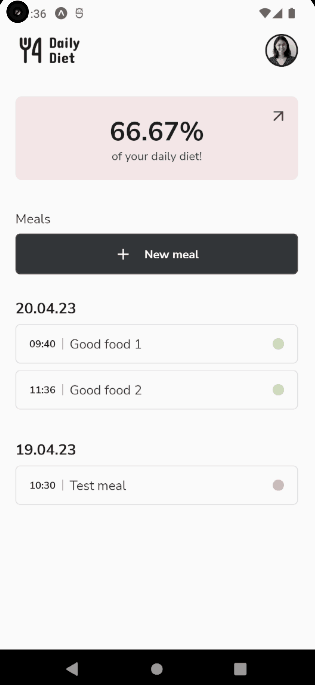
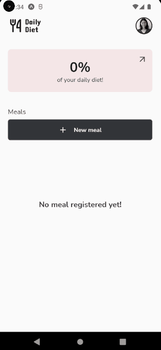
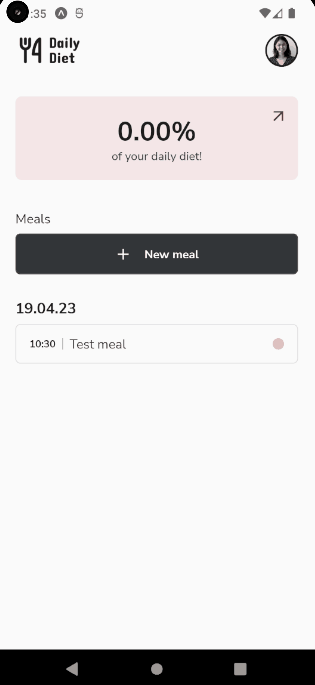
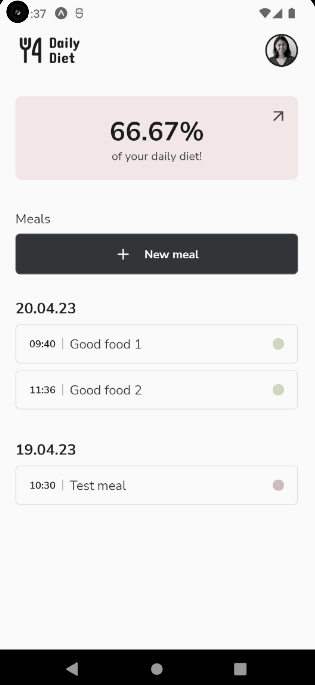
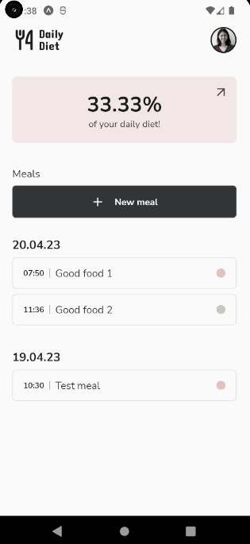

# TodoNative

An application to control what do you eat in your daily basis, it gives you some nice overview of your diet food!

## :hammer: Used techs

- ⚛️ **React-native**
- ⚛️ **Expo**
- ⚛️ **TypeScript**
- ⚛️ **AsyncStorage**
- ⚛️ **Styled-Components**
- ⚛️ **Datetime Picker**
- ⚛️ **React Navigation**

## :camera: Overview

## :camera: Adding meal

## :camera: Editing and removing meal

